# Checklist System Flowchart

## System Workflow Overview

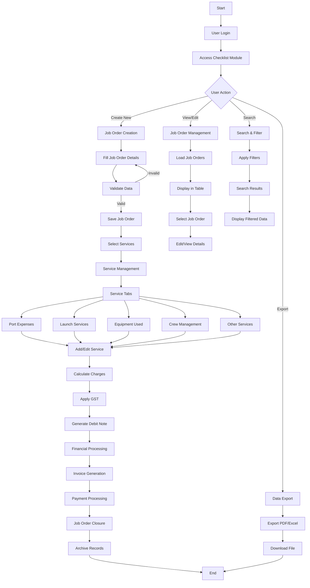

## Detailed Service Management Flow

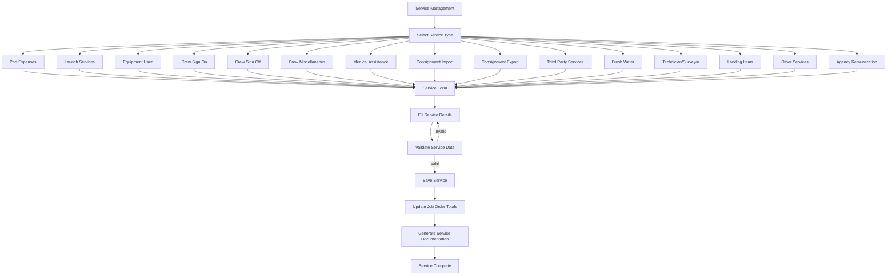

## Financial Processing Flow

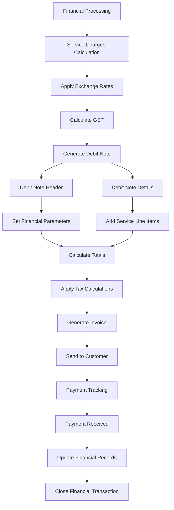

## Job Order Lifecycle

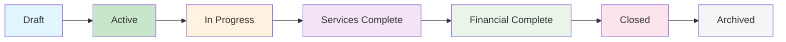

## User Interaction Flow

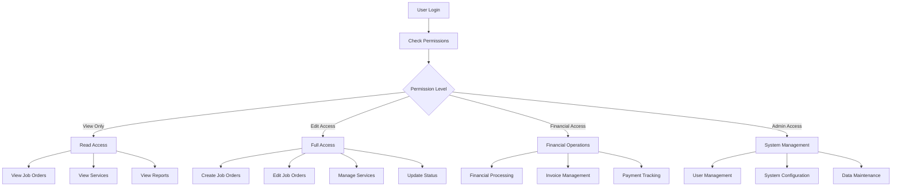

## Error Handling Flow

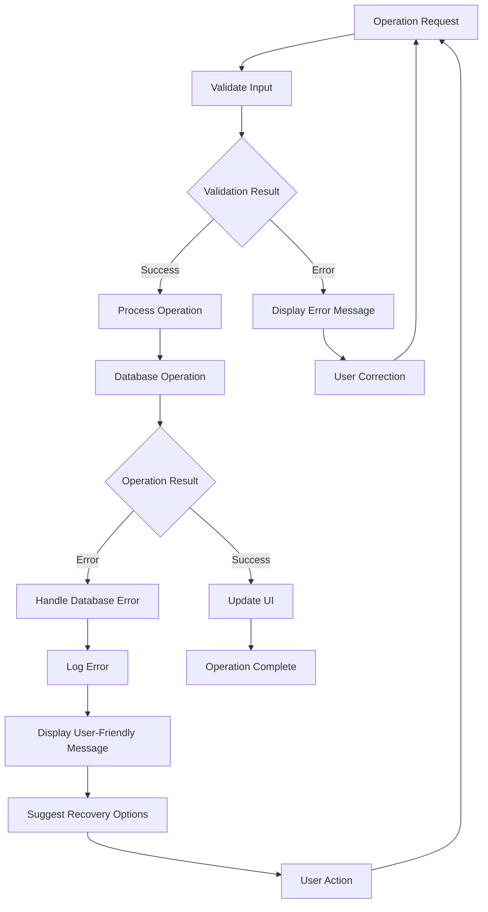

## Data Flow Architecture

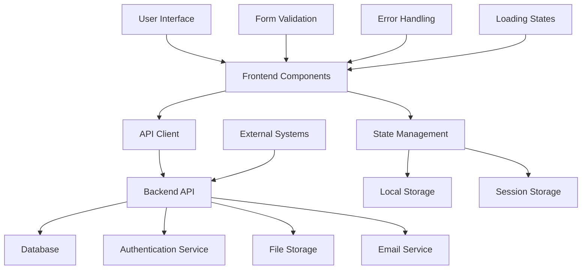

## Service-Specific Flows

### Port Expenses Flow

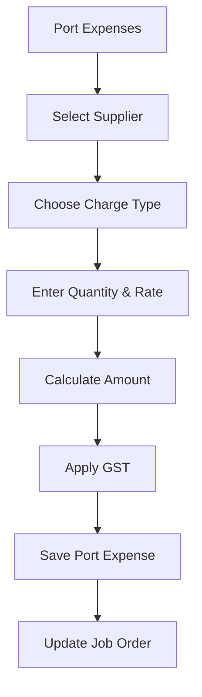

### Crew Management Flow

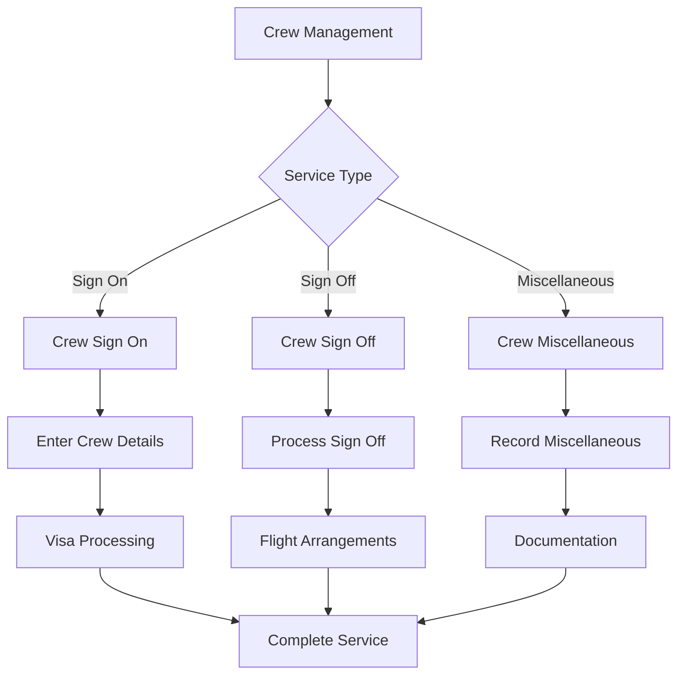

### Equipment Usage Flow

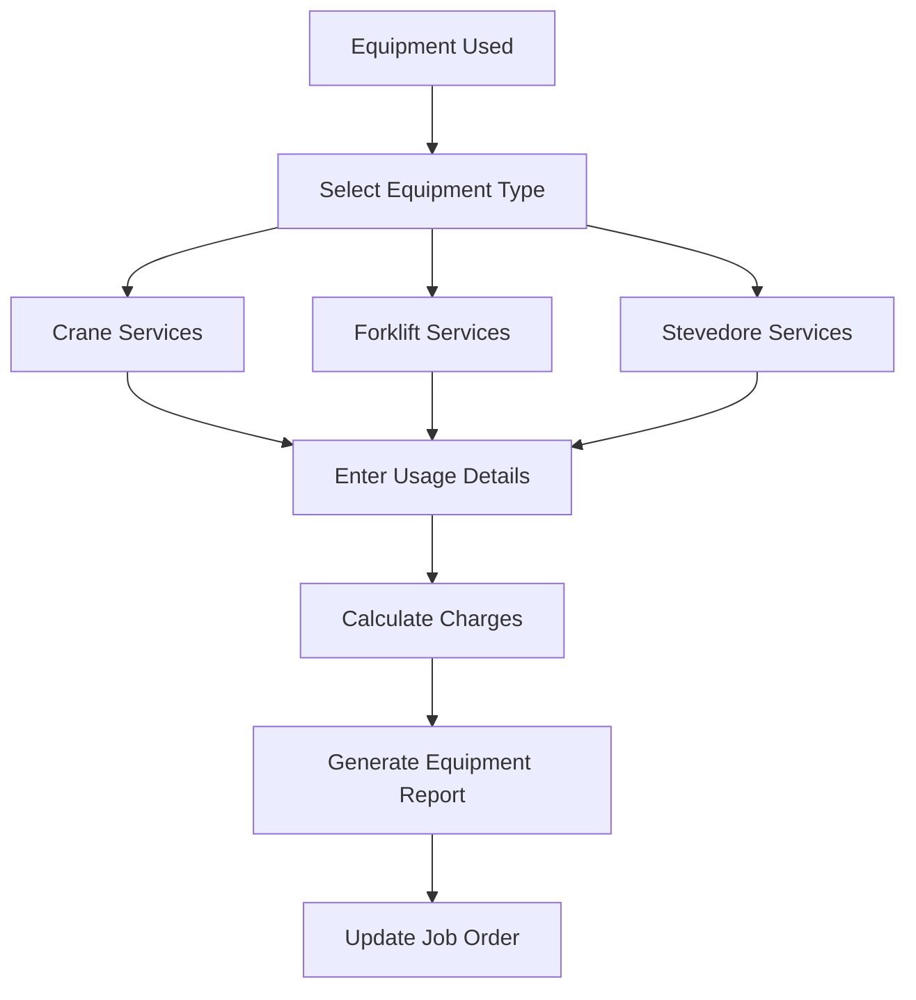

## Integration Points

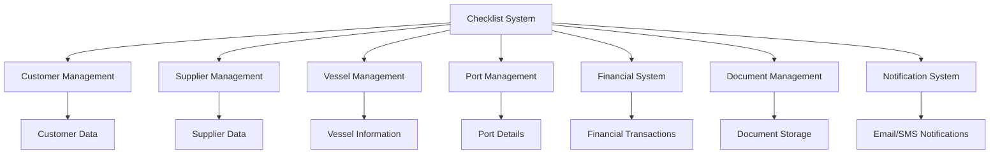
